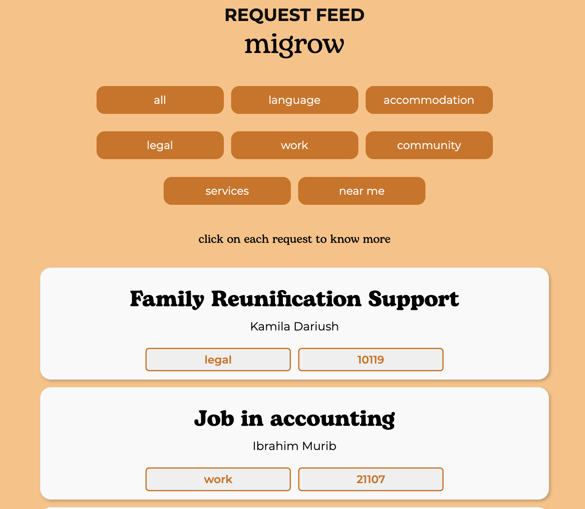

## Description

Migrow is a platform to support migrants seeking help with day-to-day issues such as legal and bureaucratic procedures, language, and accomodation within their local communities by connecting them with fellow migrants who have already overcome the hurdles of relocation to Germany, or natives who have a helping hand to lend.

 We want to foster integration and empower communities, while democratizing access to resources, information and opportunities by making them available to all. As the app is still being developed, we welcome contributions and have a list of currently available endpoints below.

 ## Requests Feed

 The core of the app is a dynamic requests feed where users can:

 - view all requests for help
 - click to expand
 - filter requests by category/near me
   

 ## Requirements

- Node.js 18.17.0 LTS

## Local setup

Clone this repository\
From the project root, run

`npm i` to install dependencies

`npm start` to start the app

The app should be accessible at localhost:3000 , with backend at localhost:3001

## Current List of API Endpoints

### Users and Authentication Endpoints

- `/users/register`
- `/users/signin`
- `/users/update`
- `/users/logout`
- `/users/:{id}`

### Requests for Help Endpoints

- `/requests/new`
- `/requests/delete/:{requestId}`
- `/requests/update/:{requestId}`
- `/requests/:{requestCategory}`
- `/requests/nearme` (Requests within 10km of the authenticated user)
- `/requests/all`

## Dev Extras

We format with prettier: `npm run format-code`

## Team

[Camila](https://github.com/camilamkp)\
[Jess](https://github.com/jesslyw)\
[Mariana](https://github.com/marianarausch)\
[Monica](https://github.com/monicafadul)

 This work is licensed under a <a rel="license" href="http://creativecommons.org/licenses/by-nc/4.0/">Creative Commons Attribution-NonCommercial 4.0 International License</a>.
